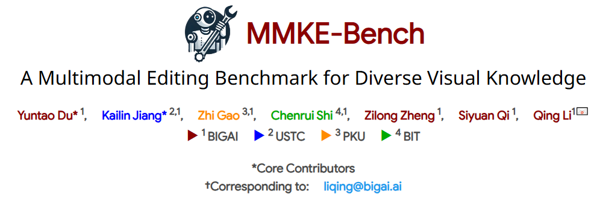
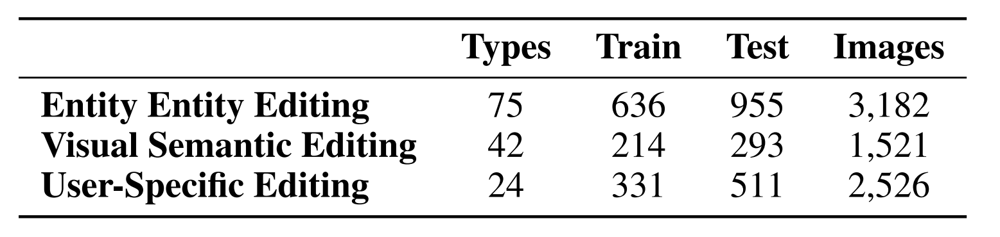
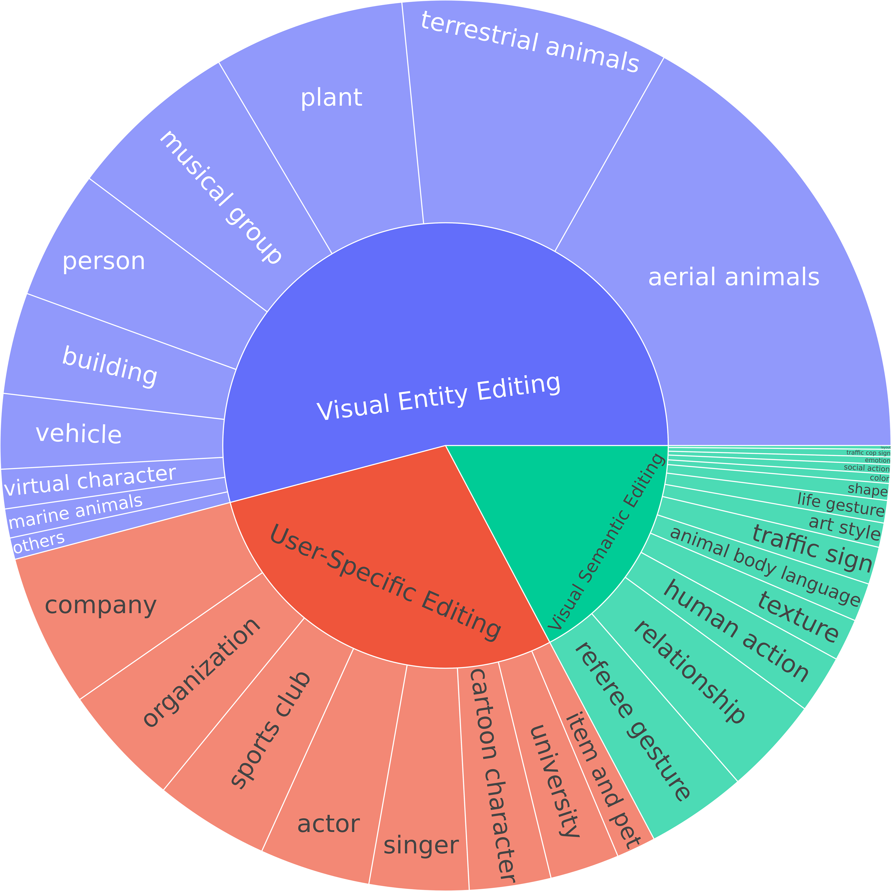

<p align="center">
    
<p>
<h5 align="center"> If you like our project, please give us a star ⭐ on GitHub.  </h2>


[]()[]()[](https://huggingface.co/datasets/MMMU/MMMU)[]()[](static/Slides/MMKE-Bench.pdf)


## Table of Contents

- [Table of Contents](#table-of-contents)
- [🔔 News](#-news)
- [🌟Overview](#overview)
- [🤗 Dataset](#-dataset)
- [😮 Highlights](#-highlights)
  - [🔥 Target learning towards a distribution rather than a one-hot target](#-target-learning-towards-a-distribution-rather-than-a-one-hot-target)
  - [💡 High continual editing performance](#-high-continual-editing-performance)
- [🛠️ Requirements and Installation](#️-requirements-and-installation)
- [🤖 Evaluation](#-evaluation)
- [💥Training](#training)
- [🚀 Main Results](#-main-results)
- [⚡️ More qualitative results](#️-more-qualitative-results)
- [👍 Acknowledgement](#-acknowledgement)
- [✏️ Citation](#️-citation)
- [Star History](#star-history)
- [🎉Contributors](#contributors)


## 🔔 News

* **[2024.07.02]**  **Code** is available now!

* **[2024.07.02]**  We release the **ICE dataset** at 🤗 [Huggingface Dataset](https://huggingface.co/datasets/Yofuria/ICE).

* **[2023.06.18]**  We hung the **paper** on 🤗 [Huggingface Papers](https://huggingface.co/papers/2406.11194).

  

## 🌟Overview

**TL;DR:** We propose <span style="color:brown">**MMKE-Bench**</span>, a challenging benchmark for evaluating diverse semantic editing in real-world scenarios.


<p align="justify">
    <strong><span style="color:black">Overview</span> of the <span style="color:brown">MMKE-Bench</span> dataset. Our contribution can be summarized as follows:</strong>
</p>

<p align="justify" style="margin-left: 30px; text-indent: -30px;">
    <strong><span style="color:black">1) Overview of MMKE-Bench</span></strong>: 
    MMKE-Bench is introduced as a benchmark designed to test semantic editing capabilities in realistic scenarios. It utilizes natural language for knowledge representation and includes three editing types aligned with practical contexts.
</p>

<p align="justify" style="margin-left: 30px; text-indent: -30px;">
    <strong><span style="color:black">2) Development of the Benchmark Pipeline</span></strong>: 
    Describes the novel pipeline used to develop the benchmark, which includes collecting original knowledge, generating editable knowledge, and crafting evaluation questions based on specific principles.
</p>

<p align="justify" style="margin-left: 30px; text-indent: -30px;">
    <strong><span style="color:black">3) Experimental Analysis and Challenges</span></strong>: 
    Details extensive experiments with various standard methods and large language models, highlighting several limitations in the existing approaches to knowledge editing in both single and multiple edit scenarios.
</p>


## 🤗 Dataset

<p align="justify">
We introduce <strong><span style="color:brown">MMKE-Bench</span></strong>, a benchmark designed to evaluate the ability of LMMs to edit visual knowledge in real-world scenarios. <strong><span style="color:brown">MMKE-Bench</span></strong> incorporates three editing tasks: <strong><span style="color:brown">visual entity editing</span></strong>, <strong><span style="color:brown">visual semantic editing</span></strong>, and <strong><span style="color:brown">user-specific editing</span></strong>. Additionally, it uses free-form natural language to represent and edit knowledge, offering more flexibility. The benchmark includes <strong><span style="color:brown">2,940</span></strong> pieces of knowledge and <strong><span style="color:brown">7,229</span></strong> images across 110 fine-grained types, with automatically generated, human-verified evaluation questions.
</p>
<div style="text-align: center;">
  <strong>Overall comparison with existing multimodal knowledge editing benchmarks>
</div>

<div align="center">
  
</div>

<div style="text-align: center;">
  <strong>The statistics of MMKE-Bench</strong>
</div>

<div align="center">
  
</div>

<div style="text-align: center;">
  <strong>The types of samples in MMKE-Bench</strong>
</div>

<div align="center">
  
</div>

​																							
You can download **MMKE-Bench data** 🤗 [Huggingface Dataset](https://huggingface.co/datasets/Yofuria/ICE). And the expected structure of files is:

```text
MMKE-Bench
|-- data_json
|   |-- entity
|   |   |-- train.json
|   |   |-- eval.json
|   |-- visual
|   |   |-- train.json
|   |   |-- eval.json
|   |-- user
|   |   |-- train.json
|   |   |-- eval.json
|-- data_image
|   |-- entity
|   |   |-- image.....
|   |-- visual
|   |   |-- image.....
|   |-- user
|   |   |-- image.....
```


## 😮 Highlights

### 🔥 Target learning towards a distribution rather than a one-hot target

**In-Context Editing (ICE)** is a novel approach to overcome the brittleness of traditional fine-tuning in knowledge editing scenarios that learns towards a one-hot target.


Comparison of ICE with static and dynamic targets on an example, where the query is `"The name of the country which Academy Award for Best Picture is associated with is?"`, and target is ` "Wassoulou Empire"`.

**The line** plots on the left illustrate the loss trajectories over optimization steps for static (top) and dynamic (bottom) targets under temperature from 0.1 to 100. **The figures** on the right show how the probabilities of the top-6 predicted tokens for **$$ x_2 $$**, the second token following the target, change with iteration steps. 

The tokens are arranged from left to right in descending order of probability without context. At early steps, the token ` "Wass"` appears due to its presence as the initial token in the target **$$ x^* $$**. At later steps, the probability of ` "Wass"` in dynamic targets (top) significantly declines, indicating successful adaptation and suppression of repetitive token predictions. In contrast, for static targets (bottom), the probability of ` "Wass"` remains relatively high throughout the optimization steps.


### 💡 High continual editing performance

**Our results confirm the effectiveness of ICE and demonstrate its potential for continual editing**, ensuring that updated information is seamlessly incorporated while preserving the integrity of existing knowledge.

<div align="center">    </div>

**Continual editing** with Llama2-7b-chat on **Wiki<sub>recent</sub>**. Each edit builds on the previous model, risking deterioration over time. The model is assessed immediately after each edit without re-evaluating previous edits, testing its ability to update continuously. While most methods deteriorate, sometimes performing worse than the unedited version, our method, ICE, maintains integrity and achieves promising performance.


## 🛠️ Requirements and Installation

```text
# clone ICE
git clone https://github.com/Yofuria/ICE.git
cd ICE

# create conda env
conda create -n ICE python=3.10
conda activate ICE

# install package
pip install -r requirements.txt
```

In **lines 32 and 33** of **` examples/run_knowedit_llama2.py`**, you need to download the **` punkt `** package.

- If your Internet **speed is fast** enough, you can **run the code directly** from the command line.

```text
if __name__ == "__main__":
    # If you have a slow Internet connection and can't download nltk quickly, comment these two lines and use the second method of Requirements and Installation in README.md
    import nltk
    nltk.download('punkt')
```

- If your Internet **speed is slow**, **comment lines 32 and 33** and **download punkt manually**🤗 [punkt]([kailinjiang/punkt · Datasets at Hugging Face](https://huggingface.co/datasets/kailinjiang/punkt)). And place it in the ICE environment directory you created, create a **nltk_data/tokenizers** folder, and **unpack punkt** into this directory.

<div align="center">    </div>


## 🤖 Evaluation

You can get the evaluation results using `eval.py`. Evaluation indicators are as follows：

- `rewrite_acc` $\rightarrow$ **Edit Success **[measures the ability of the model to produce the edited response $$ x^* $$ for a query **$$ q $$**]

  <div align="center">
    
  </div>

- `locality` $\rightarrow$ **Locality** [evaluates if the model maintains original predictions for queries outside the edit scope]

<div align="center">
  
</div>

- `portablility` $\rightarrow$ **Portablility** [assesses how well the model generalizes the knowledge for rephrased or logically related queries within the edit scope **$$ D_q $$**

<div align="center">
  
</div>

- `ngram_entropy` $\rightarrow$ **Fluency** [estimates the linguistic quality of the postedit model's output, given by a weighted sum of bi- and tri-gram entropies]

<div align="center">
  
</div>

- `PPL_r` $\rightarrow$ **PPL<sub>r</sub>** [we introduce a normalized perplexity ratio, comparing the perplexity of the generated sentence beyond the target token to that of the prompt and target token combined]

<div align="center">
  
</div>

<div align="center">
  
</div>

After the editing operation, you get a json file with error result data.

```text
{
    "pre": {
        "rewrite_acc": [],
        "portability": {
            "Subject_Aliasing_acc": [],
            "reasoning_acc": []
        },
        "fluency": {
            "ngram_entropy": 
        }
    },
    
    "case_id": 0,
    "requested_rewrite": {
        //...
    },
    
    "time": ,
    "post": {
        "rewrite_acc": [],
        "locality": {
            "Relation_Specificity_acc": [],
            "Forgetfulness_acc": []
        },
        "portability": {
            "Subject_Aliasing_acc": [],
            "reasoning_acc": []
        },
        "fluency": {
            "ngram_entropy": 
        }
    }
}
```

The data used by `PPL_r`is the edit operation that saves the sentences generated by the model.

Such as：`ICE_zsre_Llama-2-7b-chat-hf_gen_sentence.json`

```shell
python eval.py 
	--model_name_or_path=''  # Path to pre-trained model
	--output_file='./FT-M_counterfact_gpt2-xl_gen_sentence.json'  # Generated sentences file (xxx.json)
	--result_file='./FT-M_counterfact_gpt2-xl_results.json'  # Result file (xxx.json)
```

You will get the **following metrics**

```text
Edit_Succ: 30.262626262626263
Portability: 7.3802393354053
Portability (Subject_Aliasing_acc): 6.939620928384972
Portability (reasoning_acc): 3.511697773992855
Portability (Logical_Generalization_acc): 9.11111111111111
Locality: 33.95236461069794
Fluency: 557.8193009507412
ppl_r:  tensor(9.9633, device='cuda:0')
```


## 💥Training

We provide the training hyperparameters for five methods in `./hparams`. 

For ICE, we update **GPT2-xl** using **layers 13 to 17** and **Llama2-7b-chat** using **layers 4 to 8**. 

Both FT-L and FT-M use the same hparams located in `./hparams/FT`. 

For FT-L, replace `objective_optimization` with `prompt_last`, and for FT-M, replace it with `target_new`. For details on other methods, please refer to [EasyEdit](https://github.com/zjunlp/EasyEdit). You can execute the following commands to obtain results:

**For ICE:**

```shell
python examples/run_knowedit_llama2.py \
	--editing_method=ICE \
	--hparams_dir=./hparams/ICE/gpt2-xl.yaml \
    --data_dir=./data/zsre.json \  
    --datatype='zsre' \  
    --metrics_save_dir=./results/gpt2-xl/ICE
```

**For FT-L:**

```shell
python examples/run_knowedit_llama2.py \
	--editing_method=FT-L \
	--hparams_dir=./hparams/ICE/gpt2-xl.yaml \
    --data_dir=./data/zsre.json \  
    --datatype='zsre' \  
    --metrics_save_dir=./results/gpt2-xl/ICE
```

**For FT-M:**

```shell
python examples/run_knowedit_llama2.py \
	--editing_method=FT-M \
	--hparams_dir=./hparams/ICE/gpt2-xl.yaml \
    --data_dir=./data/zsre.json \  
    --datatype='zsre' \  
    --metrics_save_dir=./results/gpt2-xl/ICE
```

**For MEMIT:**

```shell
python examples/run_knowedit_llama2.py \
	--editing_method=MEMIT \
	--hparams_dir=./hparams/ICE/gpt2-xl.yaml \
    --data_dir=./data/zsre.json \  
    --datatype='zsre' \  
    --metrics_save_dir=./results/gpt2-xl/ICE
```

**For ROME:**

```shell
python examples/run_knowedit_llama2.py \
	--editing_method=ROME \
	--hparams_dir=./hparams/ICE/gpt2-xl.yaml \
    --data_dir=./data/zsre.json \  
    --datatype='zsre' \  
    --metrics_save_dir=./results/gpt2-xl/ICE
```

The optional range of `datatype` is `['zsre','recent','counterfact','wikibio']` 

**ICE/gpt2-xl.yaml**

```
alg_name: "FT"
model_name: openai-community/gpt2-xl   # or local checkpoint path
device: 0
layers: [13, 14, 15, 16, 17]
num_steps: 25
batch_size: 3
max_length: 40
lr: 7e-4
weight_decay: 0
kl_factor: 0
norm_constraint: 5e-4
grad_norm_constraint: 5e-4
num_return_sequences: 1
max_new_tokens: 3
static_target: False
sample_with_context: True
target_update_interval: 1
temperature: 100.0
print_kl: True

objective_optimization: "target_and_completion_with_context"
rewrite_module_tmp: "transformer.h.{}.mlp.c_proj"
layer_module_tmp: "transformer.h.{}"
mlp_module_tmp: "transformer.h.{}.mlp"
attn_module_tmp: "transformer.h.{}.attn"
ln_f_module: "transformer.ln_f"
lm_head_module: "transformer.wte"
model_parallel: False
```


## 🚀 Main Results

- Main results on **knowledge insertion and question-answering datasets** of Llama2-7b-chat


- Main results on **knowledge modification datasets** of Llama2-7b-chat


- **Continual editing results** of Llama2-7b-chat

<div align="center">
  
</div>


## ⚡️ More qualitative results

<div align="center">
  
</div>

<div align="center">
  
</div>

<div align="center">
  
</div>


## 👍 Acknowledgement

- [EasyEdit](https://github.com/zjunlp/EasyEdit)  An open source knowledge edit framework.
- [ROME](https://github.com/kmeng01/rome)  A related method of Locating and Editing.
- [MEMIT](https://github.com/kmeng01/memit)  A related method of Locating and Editing.


## ✏️ Citation

If you find our paper and code useful in your research, please consider giving a star :star: and citation :pencil:.

```text
@article{qi2024ice,
      title={In-Context Editing: Learning Knowledge from Self-Induced Distributions}, 
      author={Siyuan Qi and Bangcheng Yang and Kailin Jiang and Xiaobo Wang and Jiaqi Li and Yifan Zhong and Yaodong Yang and Zilong Zheng},
      year={2024},
      eprint={2406.11194},
      archivePrefix={arXiv},
      primaryClass={cs.CL},
      url={https://arxiv.org/abs/2406.11194}, 
}
```


## ⭐ Star History

[](https://star-history.com/#mmke-bench-bigai/mmke-bench&Date)


## 🎉Contributors

<a href="https://github.com/mmke-bench-bigai/mmke-bench/graphs/contributors">
  
</a>


